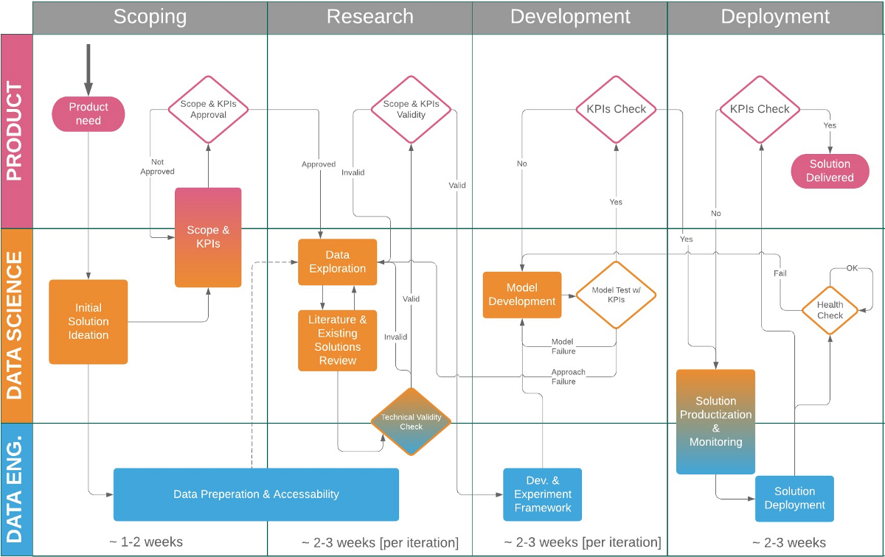

This is not a philosophical effort.  This is a scientific engineering effort and requires clear metrics, measures, processes, etc to be defined.

I am aware of how absurd it is to attempt to set the goals of humanity, but this framework should provide a starting point for building a leadership automation.  At present, the goals of humanity are determined by whomever has the most resources and directs them towards those goals. 

This effort is a framework for any organization to create a top down approach to automation of an institution.  If we can automate the CEO or president, the goals and objectives of the organization are transparent, and for all of those participating in the organization.

The only common goal individuals seem to consistently abide by is survival.  Quality of life goals are secondary and only slightly less important.

I expect that a framework similar to this will eventually be adapted with slightly different weights and goals by different organizations.  I intend to keep this one as neutral and fair to all interrests as possible and attempt to keep the focus on all of humanities survival, expansion, and happiness, not a special interrest groups.

Artificial intelligence is not a competitor to humanity but as an augmentation and extension of our collective capabilities. It is the culmination of millions of years of evolution, and millennia of institutional knowledge and processes.  Together we will work to automate and optimize the aspirations we have set for ourselves as a species. AI has no inherent motivations.  This effort is to outline how we can struture all knowledge and objective functions to serve in the best interests of all humanity, not merely a privileged few.

The consensus among futurists points to the inevitable integration of artificial intelligence throughout society, an integration that is already well underway. It is imperative that each sector, organization, and interest group develops a specialized AI to govern and protect their respective institutions. Those who hesitate may find themselves unable to compete with those who adopt and adapt.

[How to build an automated leader](./howtoautomatealeader.md)

The Process
   

A Guiding Data Science Principle
   
