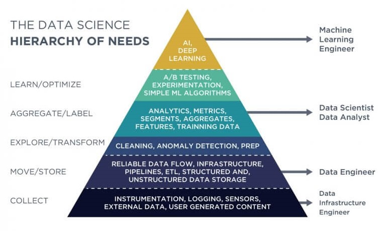

This is not a philosophical effort.  This is a scientific engineering effort and requires clear metrics, measures, processes, etc to be defined.

I am aware of how absurd it is to attempt to set the goals of humanity.  At present, the goals of humanity are determined by whomever has the most resources and directs them towards those goals.  There are attempts to pool resources and build for the common good, but governments are institutions and institutions are run by individuals with personal motivations, which leads to corruption over time.  With the right framework, perhaps we can reduce corruption and give AIs a chance to improve our goals overall.  

This effort is a framework for any organization to create a top down approach to automation of an institution.  If we can automate the CEO or president, the goals and objectives of the organization are transparent, and for all of those participating in the organization.

The only common goal individuals seem to consistently abide by is survival.  Quality of life goals are secondary and only slightly less important.  Individuals who don't prioritize survival are often prioritizing the survival of a larger institution which they belong to.

Only by creating a model for forecasting outcomes and simulating scenarios can we get closer to our common goals.

I expect that a framework similar to this will eventually be adapted with slightly different weights or priorities by different organizations.  I intend to keep this one as neutral and fair to all interrests as possible and attempt to keep the focus on all of humanities survival, expansion, and happiness, not a special interrest groups.

The Process

   
